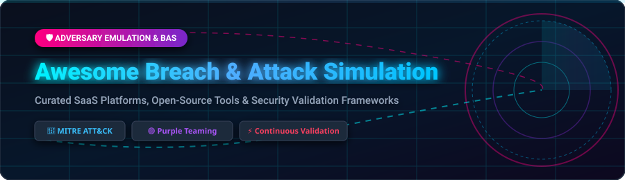

<p align="center">
  <a href="https://github.com/ishandutta2007/Awesome-Awesome-Awesome"></a>
  <a href="https://discord.gg/jc4xtF58Ve"></a>
  <a href="https://github.com/ishandutta2007/Awesome-Breach-n-Attack-Simulation/stargazers"></a>
  <a href="https://github.com/ishandutta2007/Awesome-Breach-n-Attack-Simulation/network/members"></a>
  <a href="https://github.com/ishandutta2007/Awesome-Breach-n-Attack-Simulation/blob/main/LICENSE"></a>
  <a href="https://github.com/ishandutta2007"></a>
</p>

<p align="center">
  
</p>

# 🎯 Awesome Breach & Attack Simulation (BAS) Ecosystem

> **Curated List of SaaS Platforms, Open-Source Repos & Adversary Emulation Frameworks**  
> *Focused on Continuous Security Validation, Automated Penetration Testing, Purple Teaming & Control Testing*  
> 
> 📅 **Last updated: September 2026**

---

## 📌 Overview & SEO Summary

**Breach and Attack Simulation (BAS)** represents a core pillar of modern Continuous Threat Exposure Management (CTEM). BAS solutions enable enterprise security teams, purple teams, and detection engineers to continuously validate security posture by executing automated, real-world attack scenarios across endpoint, network, email, cloud, and Active Directory environments.

This repository maintains a comprehensive directory of leading commercial SaaS platforms and active open-source adversary emulation projects mapped against the **MITRE ATT&CK Framework**.

---

## 📑 Table of Contents

- [🏢 SaaS/Hosted Platforms](#-saashosted-platforms)
- [🔓 Open-Source GitHub Projects](#-open-source-github-projects)
- [🛠️ Custom BAS Program Architecture](#%EF%B8%8F-custom-bas-program-architecture)
- [🤝 How to Contribute](#-how-to-contribute)
- [⚠️ Disclaimer](#%EF%B8%8F-disclaimer)
- [💖 Support & Sponsorship](#-support--sponsorship)
- [📈 Star History](#-star-history)

---

## 🏢 SaaS/Hosted Platforms

> 📊 **Market Insights**: The global Breach & Attack Simulation (BAS) market is estimated at **$1.8 Billion in 2026** and projected to reach **$4.5+ Billion by 2030** (CAGR ~29.5%). The market is **moderately fragmented**, actively consolidating as category leaders transition from standalone BAS engines toward comprehensive Continuous Exposure Management (CTEM) and Autonomous Red Teaming platforms.

The table below details top enterprise SaaS BAS solutions, **sorted descending by company size / valuation**:

| 🏢 Product | 📜 Description | 💰 Starting Pricing | 🎁 Free Tier / Trial Limit | 📊 Company Size (Valuation / Revenue) |
| :--- | :--- | :--- | :--- | :--- |
| **[Mandiant Security Validation](https://www.mandiant.com/)** | Advanced attack simulations backed by real-world threat intelligence (formerly Verodin). | Starting at ~$60,000/year (annual contract via Google Cloud priced per actor/agent) | No public free trial; evaluation via Google Cloud / Mandiant guided enterprise demo | **~$5.4 Billion** (Acquired by Google Cloud / Parent Alphabet ~$2.2T) |
| **[Pentera](https://www.pentera.io/)** | Automated penetration testing platform simulating full attack chains from external and internal perspectives with actionable remediation. | Starting at ~$35,000/year (annual license scaled by IP count and environment scope) | No self-serve trial; enterprise evaluation via sales-guided Proof of Concept (PoC) | **~$1.0+ Billion** (Unicorn Valuation, $150M+ Total Funding) |
| **[XM Cyber](https://www.xmcyber.com/)** | Hybrid cloud exposure management platform simulating attack paths to critical assets, identifying and prioritizing remediation. | Starting at ~£18/unit (~$15,000/year enterprise base quote) | 14-day free trial / Proof of Value (PoV) evaluation upon sales registration | **~$700 Million** (Acquired by Schwarz Group) |
| **[Cymulate](https://cymulate.com/)** | Extended security posture management platform with BAS, automated red teaming, and attack surface validation across email, web, and endpoint vectors. | Starting at ~$1,500/month (~$7,000/year for entry modular tier) | 14-day free trial (includes full access to select attack vector evaluations) | **~$150M – $200M** ($141M+ Total Funding Raised) |
| **[SafeBreach](https://www.safebreach.com/)** | Continuous security validation platform with 20,000+ attack methods simulating known threat actor behaviors across the kill chain. | Starting at ~$50,000/year (annual enterprise subscription based on deployment size) | No free tier; evaluation available via sales-guided Proof of Concept (PoC) | **~$150M+** ($106M+ Total Funding Raised) |
| **[Horizon3.ai / NodeZero](https://horizon3.ai/)** | Autonomous penetration testing platform discovering exploitable vulnerabilities and validating attack paths with proof-of-exploit. | $99 per target (TurboPentest) / Starting at ~$15,000/year (NodeZero enterprise platform) | 1 free autonomous penetration test credit provided upon account setup | **~$150M+** ($78M+ Total Funding Raised) |
| **[Picus Security](https://www.picussecurity.com/)** | Security validation platform combining BAS with threat intelligence, measuring detection and prevention effectiveness across security stack. | Starting at ~$10,000/year (entry platform tier based on attack modules) | 14-day free trial (includes access to core simulation agents and threat modules) | **~$75M – $100M** ($45M+ Total Funding Raised) |
| **[AttackIQ](https://www.attackiq.com/)** | Breach and attack simulation platform built on MITRE ATT&CK, enabling continuous validation of security controls with automated attack scenarios. | Free entry tier ($0/mo); paid plans start at $300/credit or $4,995/month for Flex | Free forever plan (AttackIQ Flex with agentless exposure testing); 30-day trial for expanded testing | **~$75M+** ($44M+ Total Funding Raised) |
| **[Scythe](https://scythe.io/)** | Adversary emulation platform with threat intelligence-driven attack scenarios, purple team collaboration, and detection validation. | Starting at ~$25,000/year (environment tier licensing with unlimited users and agents) | No free tier; 14-day hands-on evaluation lab accessible upon sales discovery call | **~$50M+** ($23M+ Total Funding Raised) |
| **[ThreatGen](https://www.threatgen.com/)** | Cyber range and attack simulation platform with gamified red team/blue team exercises for training and validation. | $14.99 one-time (Steam edition) / Starting at $49/month for Individual subscription | Free community tier (single-player tutorial & basics); 30-day trial for Business Seats | **~$5M – $10M** (Independent / Bootstrapped) |

---

## 🔓 Open-Source GitHub Projects

> 💡 **Community Note**: Open-source adversary emulation tools enable vendor-independent control validation, custom TTP development, and purple teaming.

The list below contains top open-source projects, **sorted descending by GitHub star count**:

- **[Metasploit Framework](https://github.com/rapid7/metasploit-framework)** [](https://github.com/rapid7/metasploit-framework/stargazers)  
  ⚡ The world's most widely used penetration testing and exploit development framework from Rapid7. Ranked #2 in an IEEE open-source adversary emulation study. Provides thousands of exploit modules, payloads, and post-exploitation scripts for simulating real-world adversary behavior.

- **[Atomic Red Team](https://github.com/redcanaryco/atomic-red-team)** [](https://github.com/redcanaryco/atomic-red-team/stargazers)  
  ⚡ Library of small, highly focused unit tests mapped directly to MITRE ATT&CK techniques, maintained by Red Canary. Contains over 1,600 atomic tests executed via PowerShell (`Invoke-AtomicRedTeam`) or command line to test specific detection rules.

- **[MITRE Caldera](https://github.com/mitre/caldera)** [](https://github.com/mitre/caldera/stargazers)  
  ⚡ The premier open-source automated adversary emulation platform created by MITRE. Operates a central C2 server and cross-platform agents (Sandcat) to orchestrate complex attack playbooks across all post-compromise ATT&CK tactics.

- **[Infection Monkey](https://github.com/guardicore/monkey)** [](https://github.com/guardicore/monkey/stargazers)  
  ⚡ Open-source, agent-based breach simulation tool from Guardicore (Akamai). Simulates lateral movement, credential theft, and ransomware propagation across enterprise networks with automated reporting via Monkey Island.

- **[CyberBattleSim](https://github.com/microsoft/CyberBattleSim)** [](https://github.com/microsoft/CyberBattleSim/stargazers)  
  ⚡ Microsoft Research project providing an experimental Python OpenAI Gym environment for modeling and simulating automated security agent behavior using reinforcement learning.

- **[APTSimulator](https://github.com/NextronSystems/APTSimulator)** [](https://github.com/NextronSystems/APTSimulator/stargazers)  
  ⚡ Windows batch script from Nextron Systems that uses native tools and artifacts to simulate a compromised host state for quick endpoint security control testing.

- **[Splunk Attack Range](https://github.com/splunk/attack_range)** [](https://github.com/splunk/attack_range/stargazers)  
  ⚡ Open-source automation tool for spinning up cloud-based instrumented environments (AWS/Azure) equipped with Splunk, Active Directory, Kali Linux, and Atomic Red Team for detection development.

- **[Stratus Red Team](https://github.com/DataDog/stratus-red-team)** [](https://github.com/DataDog/stratus-red-team/stargazers)  
  ⚡ Cloud-native adversary emulation tool from Datadog for simulating granular attack techniques against AWS, Azure, GCP, and Kubernetes environments.

- **[Network Flight Simulator](https://github.com/alphasoc/flightsim)** [](https://github.com/alphasoc/flightsim/stargazers)  
  ⚡ Lightweight command-line utility from AlphaSoc for generating malicious network traffic (DNS tunneling, DGA, cryptomining, C2 traffic) to validate network security controls.

- **[Red Team Automation (RTA)](https://github.com/endgameinc/RTA)** [](https://github.com/endgameinc/RTA/stargazers)  
  ⚡ Script library from Endgame designed to emulate blue team detection triggers mapped to MITRE ATT&CK post-exploitation TTPs.

- **[OpenBAS](https://github.com/OpenBAS-Platform/openbas)** [](https://github.com/OpenBAS-Platform/openbas/stargazers)  
  ⚡ ISO 22398 compliant open-source breach and attack simulation platform from Filigran. Simulates multi-vector security incidents, technical injects, crisis communications, and business impacts with OpenCTI integration.

- **[PurpleSharp](https://github.com/mvelazc0/PurpleSharp)** [](https://github.com/mvelazc0/PurpleSharp/stargazers)  
  ⚡ C#-based adversary simulation tool designed to automate attack technique execution against Windows Active Directory environments.

- **[DumpsterFire](https://github.com/TryCatchHCF/DumpsterFire)** [](https://github.com/TryCatchHCF/DumpsterFire/stargazers)  
  ⚡ Modular, menu-driven security drill tool for creating customized security events, fake incident triggers, and blue team exercises.

---

## 🛠️ Custom BAS Program Architecture

To build a robust, vendor-neutral enterprise Breach & Attack Simulation architecture:

```
                  ┌─────────────────────────────────────────┐
                  │          SIEM / EDR / SOAR              │
                  │  (Splunk, Microsoft Sentinel, CrowdStrike)│
                  └────────────────────▲────────────────────┘
                                       │ Telemetry & Alerts
 ┌────────────────────────┐   ┌────────┴────────┐   ┌────────────────────────┐
 │   Adversary Engine     │   │ Detection Rules │   │  Cloud & Traffic Ops   │
 │ (Caldera / Metasploit) ├──►│ (Atomic Red Team)│◄──┤ (Stratus / FlightSim)  │
 └────────────────────────┘   └─────────────────┘   └────────────────────────┘
```

1. **Core Emulation Engine**: Use **MITRE Caldera** for orchestrating complex multi-stage attack playbooks.
2. **Granular Unit Testing**: Deploy **Atomic Red Team** tests for atomic rule verification.
3. **Cloud & Infrastructure Testing**: Use **Stratus Red Team** for AWS/GCP/K8s validation and **Splunk Attack Range** for lab automation.
4. **Crisis & Incident Drills**: Deploy **OpenBAS** to test organizational response and communication procedures.

---

## 🤝 How to Contribute

Contributions are warmly welcomed! To contribute:

1. Fork this repository.
2. Add your tool to `README.md` following the established table / list formatting.
3. Ensure all descriptions remain factual, neutral, and accompanied by correct links.
4. Check out the main awesome list collection at [Awesome-Awesome-Awesome](https://github.com/ishandutta2007/Awesome-Awesome-Awesome).
5. Open a Pull Request with a clear description of your additions.

---

## ⚠️ Disclaimer

- This list is **community-curated** for educational, research, and defensive security testing purposes.
- All attack simulation tools must be executed **only in authorized environments** with explicit permission.
- Commercial trademarks belong to their respective owners.

---

## 💖 Support & Sponsorship

If you find this repository helpful for your security team or research, please consider supporting the project!

- 🌟 **Star this repository** to help others discover it.
- 🔀 **Fork and share** it with your purple team colleagues and community.
- ☕ **Buy me a coffee / Sponsor**: Support ongoing maintenance via the [GitHub Sponsor Dashboard](https://github.com/sponsors/ishandutta2007).

Thank you for helping make breach and attack simulation more open, transparent, and vendor-neutral!

---

## 📈 Star History

[](https://star-history.dera.page/#ishandutta2007/Awesome-Breach-n-Attack-Simulation&type=date&legend=top-left)
